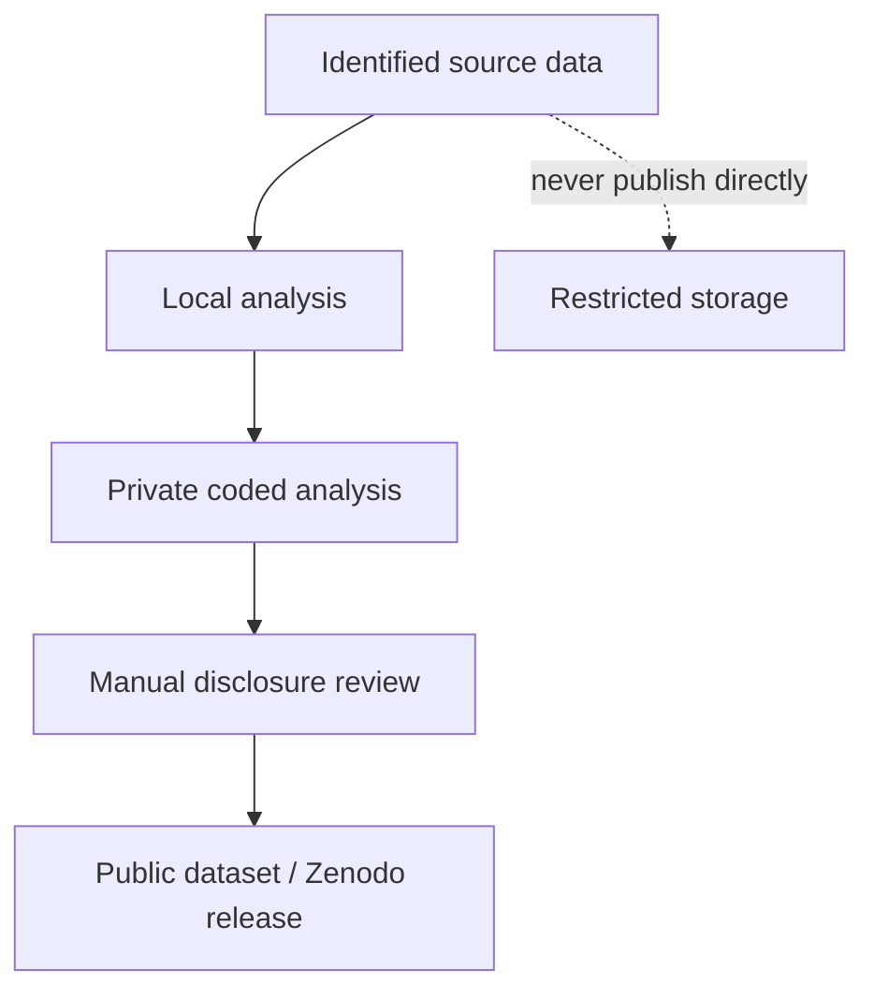

# Analysis modes

## Identified analysis

This mode keeps real folder names and may include photographs and profile details in reports. It is intended for authorised local use.

## Private coded analysis

This mode replaces displayed referee identities with deterministic session codes:

```text
REF001
REF002
REF003
```

Match names are also presented generically as `Partido 01`, `Partido 02`, etc. This reduces accidental disclosure through console output and generated filenames.

!!! danger "Pseudonymisation is not anonymisation"
    Codes can still be linked back to identities if the folder ordering, source files, photographs or external mapping tables are retained. Before public deposition, inspect every generated file and remove any residual identifiers.

## Recommended release workflow


