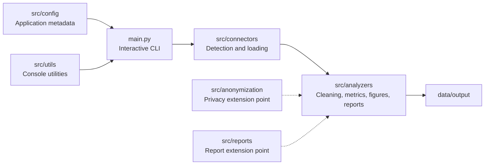

# Architecture

## Core modules

### `main.py`

Controls menus, mode selection, referee and match selection, and dispatches each analysis to `procesar_arbitro_seleccionado`.

### `src/connectors/input_detector.py`

Discovers referee directories under `data/input` and returns them in case-insensitive alphabetical order.

### `src/connectors/file_detector.py`

Classifies files inside a referee folder and provides the match-file list to the interface.

### `src/connectors/excel_loader.py`

Loads supported Excel and CSV files, selects the first non-empty worksheet and returns cleaned data plus audit metadata.

### `src/analyzers/fatigue_analyzer.py`

Contains metric computation, profile handling, graph generation, heatmaps, Word formatting, translation helpers and end-to-end referee processing.

## Extension points

The `anonymization` and `reports` packages provide clear locations for future separation of privacy and reporting logic from the main analyzer module.
