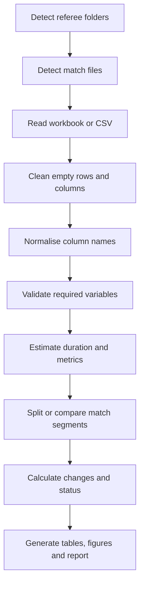

# Methodology

## Processing sequence

## Descriptive design

The current implementation computes match summaries and percentage changes relative to a reference point in the selected series. It also creates narrative interpretations and status categories to support applied review.

## Data cleaning

Heart-rate processing excludes physiologically implausible values below 40 bpm or above 230 bpm. Excel reading searches for a usable worksheet, while CSV reading attempts automatic separator detection and common encodings.

## Transparency

The source code remains the definitive specification. Thresholds, column mappings and report wording should be reviewed before each scientific release because the project is currently an alpha version.
