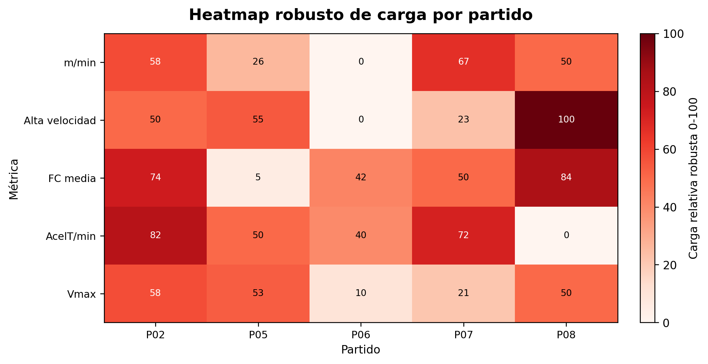

# Outputs and reports

The analysis generates complementary outputs for audit, interpretation and reporting.

## Excel summary

`*_resumen_fatiga.xlsx` contains match-level derived indicators and enables independent checking or downstream statistical analysis.

## Trend figures

The standard figure set covers:

1. metres per minute;
2. high-speed activity;
3. mean heart rate;
4. relative accelerometry load;
5. a normalised load heatmap.

{ .report-preview }

## Heatmap audit workbook

`*_heatmap_auditoria.xlsx` preserves the values used to generate the heatmap, improving traceability between visual output and tabular data.

## Practical Word report

The Word report can include referee profile information, competition branding, figures, comments, match comparisons, a traffic-light summary and a glossary. Reports are produced in landscape orientation to accommodate wide scientific tables.

{ .report-preview }
