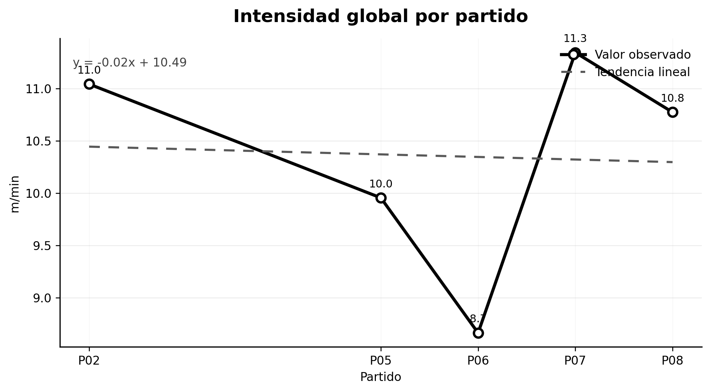
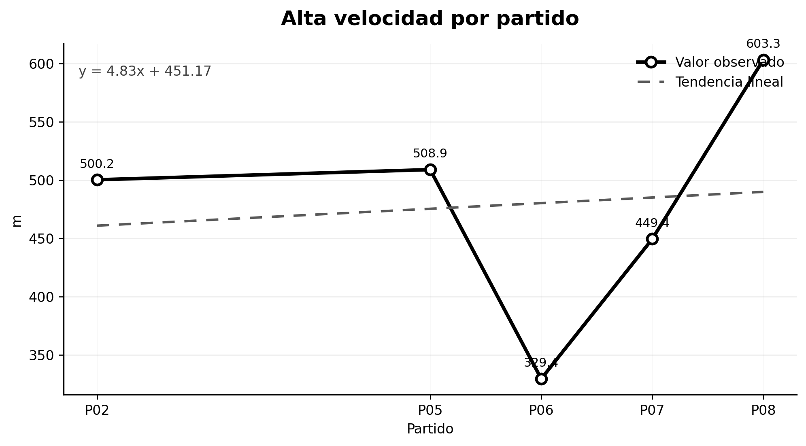
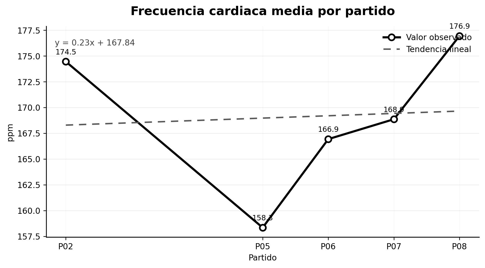
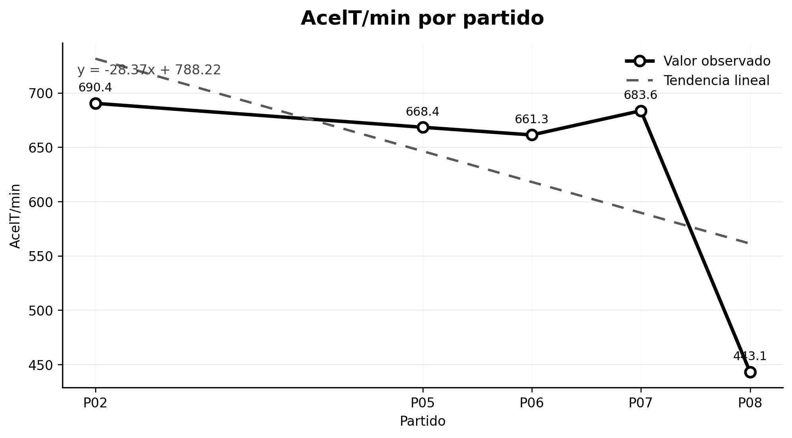

# User Guide

## Execution modes

### Identified analysis

This mode keeps the original referee name, photograph, folder name and filenames. Use it only in an authorised local research environment because the generated reports may contain personal data.

### Private coded analysis

This mode assigns sequential identifiers such as `REF001`, `REF002` and `REF003`. It also displays generic match labels rather than original filenames. Use this mode when preparing reproducible examples, public documentation or Zenodo deposits.

## Input detection

The application scans `data/input` and treats every subfolder as a referee. Match files are detected within each referee folder and sorted before selection.

For Excel files, the loader examines all worksheets and uses the first sheet containing data. For CSV files, it automatically attempts separator detection and supports UTF-8 and Latin-1 encoding.

## Main indicators

### External load

| Indicator | Unit | Interpretation |
|---|---:|---|
| Duration | min | Estimated effective duration of the match file. |
| Total distance | m | Overall locomotor volume. |
| Relative distance | m/min | Distance normalised by duration. |
| Mean speed | km/h | Average movement speed. |
| Maximum speed | km/h | Peak locomotor demand. |
| High-speed distance | m | Distance accumulated at 15 km/h or above. |
| Speed zones | %, min, m | Distribution in Z1–Z5 intensity bands. |

The implemented speed zones are:

- Z1: 0–6 km/h
- Z2: 6–12 km/h
- Z3: 12–15 km/h
- Z4: 15–18 km/h
- Z5: above 18 km/h

### Internal load

| Indicator | Unit | Interpretation |
|---|---:|---|
| Mean heart rate | bpm | Average cardiovascular response. |
| Maximum heart rate | bpm | Peak cardiovascular response. |

Heart-rate values outside the physiologically plausible interval used by the analyser are excluded before summaries are calculated.

### Mechanical load

| Indicator | Unit | Interpretation |
|---|---:|---|
| Mean AcelT | a.u. | Mean instantaneous mechanical load. |
| Total AcelT | a.u. | Accumulated mechanical volume. |
| Relative AcelT | AcelT/min | Mechanical intensity normalised by duration. |

## Generated outputs

### Excel summary

The summary workbook consolidates match-level results and supports later statistical analysis, auditing and reproducibility checks.

### Word report

The practical report includes referee information when available, descriptive tables, chronological figures, interpretation text and a load heatmap. Reports are created in Spanish by the current application entry point.

### Relative distance

### High-speed distance

### Mean heart rate

### Relative mechanical load

### Normalised load heatmap

## Interpreting trends

The figures show match order on the horizontal axis and the selected indicator on the vertical axis. A decrease over consecutive matches may be compatible with accumulated fatigue, but interpretation must consider match duration, role, environmental conditions, recovery, measurement quality and tactical context.

The software generates descriptive evidence; it does not independently establish a clinical diagnosis or causal conclusion.

## Data protection

Do not publish identified input folders or identified reports without an appropriate lawful basis, research approval and participant consent. For open repositories, use private coded mode and inspect every generated file before release.

## Troubleshooting

### No referees are detected

Confirm that referee folders are directly inside `data/input`.

### No matches are detected

Confirm that files use one of the supported extensions and are located inside the selected referee folder.

### An Excel file cannot be loaded

Open it manually and verify that at least one worksheet contains a non-empty table with a header row.

### A report omits a metric

Verify that the input column name can be recognised and that the column contains numeric data. Different GNSS or tracking exports may require column-name adaptation in the analyser.
